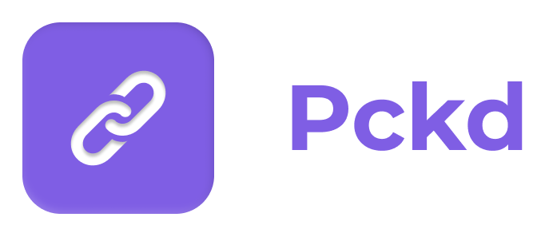
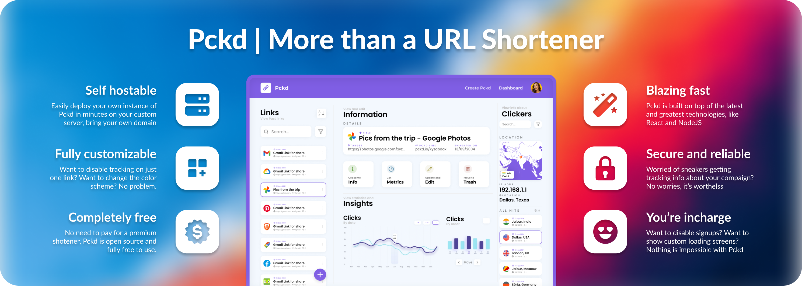
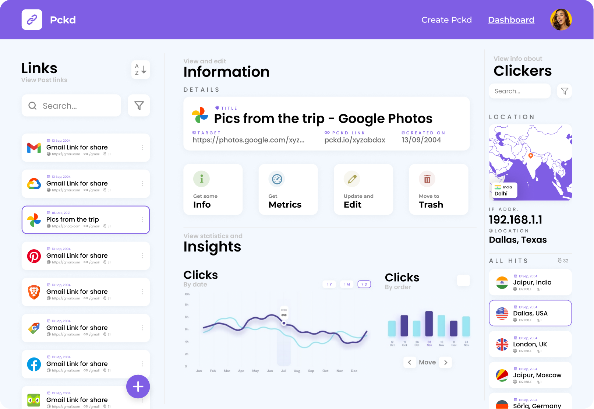

<!-- PROJECT Intro -->
 

  

  

    More than just a URL Shortener 😎
     
    <a href="https://github.com/Just-Moh-it/Pckd"><strong>Explore the docs »</strong></a>
     
     
    <a href="https://www.figma.com/file/MVq5Q3fhVJB2r70r7I3nJ3/Pckd?node-id=102%3A2">Design file on Figma</a>
    ·
    <a href="https://github.com/Just-Moh-it/Pckd/issues">Report Bug</a>
    ·
    <a href="https://github.com/Just-Moh-it/Pckd/issues">Request Feature</a>
  

<!-- TABLE OF CONTENTS -->

  
📃 Table of Contents

  <ol>
    <li>
      <a href="#about-the-project">About The Project</a>
      <ul>
        <li><a href="#screenshots">Screenshots</a></li>
        <li><a href="#motivation">Motivation</a></li>
        <li><a href="#built-with">Built With</a></li>
      </ul>
    </li>
    <li>
      <a href="#getting-started">Getting Started</a>
      <ul>
        <li><a href="#prerequisites">Prerequisites</a></li>
        <li><a href="#installation">Installation</a></li>
        <li><a href="#extras">Extras</a></li>
        <ul>
            <li><a href="#adding-new-users">Adding New Users</a></li>
        </ul>
      </ul>
    </li>
    <li><a href="#usage">Usage</a></li>
    <li><a href="#roadmap">Roadmap</a></li>
    <li><a href="#contributing">Contributing</a></li>
    <li><a href="#license">License</a></li>
    <li><a href="#contact">Contact</a></li>
    <li><a href="#acknowledgments">Acknowledgments</a></li>
  </ol>

<!-- ABOUT THE PROJECT -->

# 💁 About The Project

<!-- PROJECT SHIELDS -->

[![Contributors][contributors-shield]][contributors-url]
[![Last Commit][last-commit-shield]][last-commit-url]
[![Forks][forks-shield]][forks-url]
[![Stargazers][stars-shield]][stars-url]
[![Issues][issues-shield]][issues-url]
[![MIT License][license-shield]][license-url]

Pckd is an open source, design-focued and the coolest Python-based Hotel Management System on GitHub. Built with Python 3, Tkinter and MySQL, and initially created as a high school CS project, it comprises of all the necessary Hotel Management **features** like:

- Login 🔑 and Authentication through 🐬 MySQL database 😍
- The ability to add, update, view and delete new records for:
  - 🔐 Rooms,
  - 💁 Guests, and
  - ⏰ Reservations
- Secret Storage 👮 and handling using 💻 environment variables

This project was created as a proof that ancient frameworks like Tkinter could be used to create impressive applications with beautiful user interfaces.

(<a href="#top">back to top</a>)

## 📸 Screenshots

Here is a sneak peak of the application and it's visuals 😍:

<table>
    <tr>
        <td colspan="2">
            
             
            
Dashboard Page

        </td>
    </tr>
    <tr>
        <td>
            
             
            
Login
</td>
        <td>
            
             
            
Signup
</td>
    </tr>
    <tr>
        <td>
            
             
            
Add Reservation Page
</td>
        <td>
            
             
            
Update Reservation
</td>
    </tr>
    <tr>
        <td>
            
             
            
View Reservations
</td>
        <td>
            
             
            
Confirm Logout
</td>
    </tr>
</table>

Want to create your own iteration? [View the designs on Figma](https://www.figma.com/file/MVq5Q3fhVJB2r70r7I3nJ3/Pckd?node-id=102%3A2), and then export to Python code with [Tkinter Designer](https://github.com/ParthJadhav/Tkinter-Designer) ☄️.

(<a href="#top">back to top</a>)

<!-- Motivation -->

## 🤗 Motivation

This project was created as a 12th grade Computer Science Project. Extra efforts were put in to make it stand out among others' projects, and since it was never meant to be used in real life, practicality was not the top most concern.

    
More info...

    
As per CBSE (the Central Education Board) in India, students with Informatics Practices as a subject need to show their knowledge of Python and MySQL by creating an application that gets evaluated at the end of the year by an examiner/teacher from other schools, and hence the final grades for high school are determined. So, the application was a culmination of team effort, endurance and dedication of our duo. You could see through the commit history, where we started, how it stagnated and then we got the project where it is today.

(<a href="#top">back to top</a>)

## 😲 Built With (Tech Stack)

The following technologies were involved in the making of this project.

- [Python 3](https://python.org/) 🐍 - For running the main application code
- [Tkinter](https://docs.python.org/3/library/tk.html/) & [TTk](https://docs.python.org/3/library/tkinter.ttk.html) - For the user Interface
- [MySQL Server](https://www.mysql.com/) 🐬 - For handling database and queries
- [MySQL Connector Python](https://dev.mysql.com/doc/connector-python/en/) - For querying MySQL through python
- [Tkinter Designer](https://github.com/ParthJadhav/Tkinter-Designer) ☄️ - For exporting the Figma user interface to python code
- [Numpy](https://numpy.org/) 🧮 - As a dependency for Matplotlib
- [Matplotlib](https://matplotlib.org/) 📈 - For creating and showing graphs and visualizations
- [Python Dotenv](https://github.com/theskumar/python-dotenv) 🤫 - For loading environment variables from the [`.env` file](https://zetcode.com/javascript/dotenv/)

(<a href="#top">back to top</a>)

<!-- GETTING STARTED -->

# 🤯 Getting Started

To get started with having your own instance of Pckd, follow the steps described in the following section

_**NOTE**_: Here are the [**DETAILED INSTRUCTIONS**](/docs/getting-started.md)

## 🌂 Prerequisites

You will need these to be already installed:

- Python 3
- PiP 3
- MySQL Server

(<a href="#top">back to top</a>)

## 💾 Installation

Follow these steps to get started with your own instance of Pckd

1. Clone the repo and `cd` to the folder
1. Install PiP dependencies `pip install -r requirements.txt`
1. Setup the database from the [`sql/schema.sql`](sql/schema.sql) schema file
1. Rename `.env.example` to `.env` and replace values with your credentials
1. Install the fonts from the `assets` folder
1. Run the `main.py` file and use `username` and `password` as the default credentials on the login screen.

If you have any problems following the steps, [here are the detailed instructions](/docs/getting-started.md)

(<a href="#top">back to top</a>)

# 🤩 Roadmap

- [x] ~~Add singup and forget password capabilites~~ ([issue #3](/issues/3))
- [ ] Adding bcrypt hashing to passwords ([Issue #2](/issues/2))
- [ ] Adding Support for showing MySQL errors if database is not reachable ([Issue #4](/issues/4))

See the [open issues](https://github.com/Just-Moh-it/Pckd/issues) for a full list of proposed features (and known issues).

(<a href="#top">back to top</a>)

<!-- CONTRIBUTING -->

# 🙃 Contributing

Contributions are what make the open source community such an amazing place to learn, inspire, and create. Any contributions you make are **greatly appreciated**.

If you have a suggestion that would make this better, please fork the repo and create a pull request. You can also simply open an issue with the tag "enhancement".
Don't forget to give the project a star! Thanks again!

1. Fork the Project
2. Create your Feature Branch (`git checkout -b feature/AmazingFeature`)
3. Commit your Changes (`git commit -m 'Add some AmazingFeature'`)
4. Push to the Branch (`git push origin feature/AmazingFeature`)
5. Open a Pull Request

(<a href="#top">back to top</a>)

<!-- LICENSE -->

# 😋 License

Distributed under the MIT License. See [`LICENSE.txt`](/LICENSE.txt) for more information.

(<a href="#top">back to top</a>)

<!-- CONTACT -->

# 🤙😅 Contact

[Mohit Yadav](https://github.com/Just-Moh-it) will be handling and maintaining the project and add releevant updates if necessary. Here are the contact details:

Mohit Yadav - 🕊 [@just_moh_it](https://twitter.com/just_moh_it) - 📨 [me@mohityadav.codes](mailto:me@mohityadav.codes)

Project Link: [https://github.com/Just-Moh-it/Pckd](https://github.com/Just-Moh-it/Pckd)

(<a href="#top">back to top</a>)

<!-- ACKNOWLEDGMENTS -->

# 😊 Acknowledgments

- **Parth Jadhav and team** for their Amazing [Tkinter Designer](https://github.com/ParthJadhav/Tkinter-Designer) ☄️. This project would not have been what it is and looks without it. Highly recommend checking it out.
- [Nikuu 3d Illustration Pack by Paperpillar
  ](https://www.figma.com/community/file/1000311109311441524) - Illustrations used on the dashboard and the login page
- [Montserrat Font](https://fonts.google.com/specimen/Montserrat) Creators

(<a href="#top">back to top</a>)

# 🥰 Endnode

Just one last thing, if you have reached this far, why not consider giving a star to the repo like [many amazing people](/stargazers) already have. This keeps us going and we love to see that people like our projects, and motivates us to make more of these. With that, thank you loads 😊🥰

<!-- MARKDOWN LINKS & IMAGES -->
<!-- https://www.markdownguide.org/basic-syntax/#reference-style-links -->

[contributors-shield]: https://img.shields.io/github/contributors/Just-Moh-it/Pckd.svg?style=flat-square&logo=github
[contributors-url]: https://github.com/Just-Moh-it/Pckd/graphs/contributors
[last-commit-shield]: https://img.shields.io/github/last-commit/Just-Moh-it/Pckd?style=flat-square&logo=anchor
[last-commit-url]: https://github.com/Just-Moh-it/Pckd/commit/main
[forks-shield]: https://img.shields.io/github/forks/Just-Moh-it/Pckd.svg?style=flat-square&logo=curseforge
[forks-url]: https://github.com/Just-Moh-it/Pckd/network/members
[stars-shield]: https://img.shields.io/github/stars/Just-Moh-it/Pckd.svg?style=flat-square&logo=Apache-Spark
[stars-url]: https://github.com/Just-Moh-it/Pckd/stargazers
[issues-shield]: https://img.shields.io/github/issues/Just-Moh-it/Pckd.svg?style=flat-square&logo=testing-library
[issues-url]: https://github.com/Just-Moh-it/Pckd/issues
[license-shield]: https://img.shields.io/github/license/Just-Moh-it/Pckd.svg?style=flat-square&logo=gmail
[license-url]: https://github.com/Just-Moh-it/Pckd/blob/master/LICENSE.txt
[logo]: assets/Readme-assets/logo-full.png
